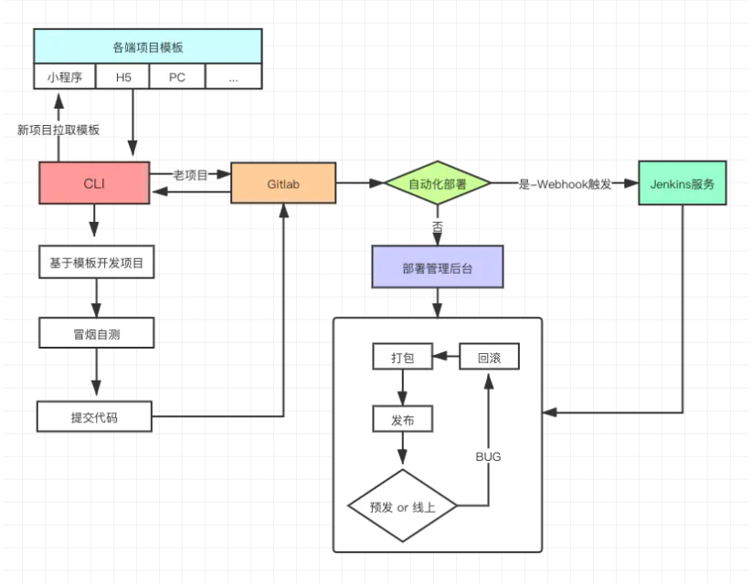
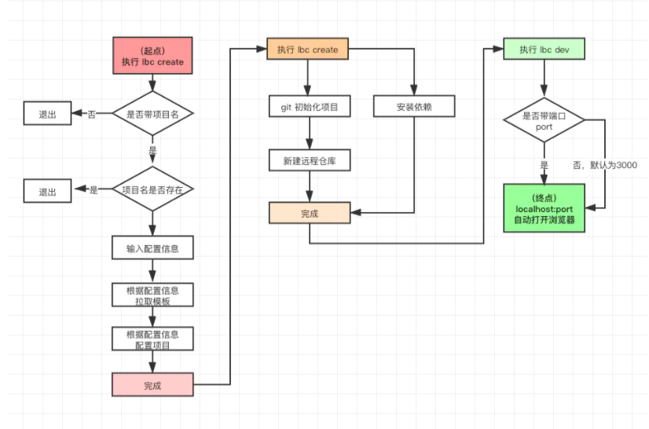

# ling-cli
自我定义的私有脚手架

## 概念
> 我们经常用最熟悉的就是 create-react-app 和 vue-cli脚手架来从零到一搭建自己的项目，来帮助我们”搭建-运行-构建“项目。但在实际的项目开发中，其实是需要我们自己去订制一套符合公司的脚手架，跟公司一些基础服务打通，上下游的衔接，内置的工具集合等，这是我们就需要自己为公司开发一个定制化的脚手架

前端脚手架 CLI，是一个命令行工具，它的出现主要解决这几个问题：
. 减少重复性工作
. 规范项目开发目录结构
. 统一团队统一开发风格，便于跨团队合作，以及后期维护，降低新人上手成本
. 提供一键前端项目的创建、配置、本地开发、插件扩展等功能，让开发者更多时间专注于业务

## 基本思路
### CLI 搭建项目
根据用户输入生成配置文件
下载指定项目模板
在目标目录生成新项目
### CLI 运行项目
本地启动预览
热更新
语法、代码规范检测
### 部署项目
代码推送至仓库
前端部署的管理后台去进行发布
或
Webhook(自动触发)♥(ˆ◡ˆԅ)
> npm包的方式进行发布，直接安装使用

#### 依赖分析
常见依赖：
babel-cli/babel-env：语法转换工具，有了它我们在开发脚手架的时候就可以使用 ES6 语法了，不要问我为什么要用 ES6，因为它神奇而伟大
commander：命令行工具，有了它我们就可以读取命令行命令，知道用户想要做什么了
inquirer： 交互式命令行工具，给用户提供一个漂亮的界面和提出问题流的方式
download-git-repo：下载远程模板工具，负责下载远程仓库的模板项目
chalk：颜色插件，用来修改命令行输出样式，通过颜色区分 info、error 日志，清晰直观
ora：用于显示加载中的效果，类似于前端页面的 loading 效果，像下载模板这种耗时的操作，有了 loading 效果可以提示用户正在进行中，请耐心等待
log-symbols：日志彩色符号，用来显示√ 或 × 等的图标

### 脚手架架构图

